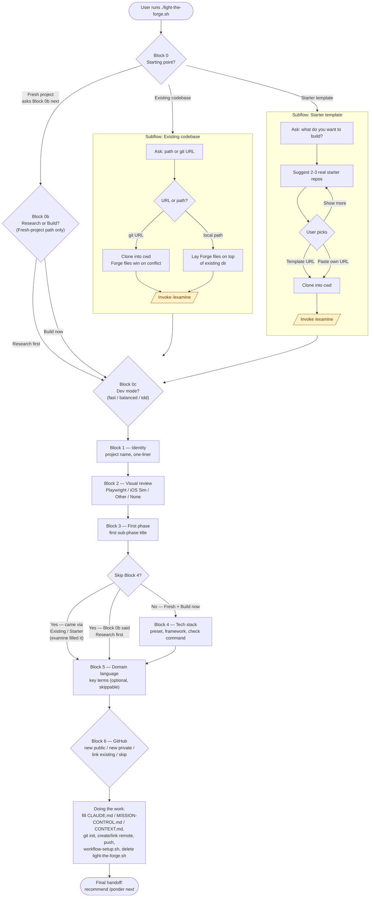

# Light the Forge — Question Tree

This is a one-screen map of every Block and branch in the `/light-the-forge` (LTF) Q&A.
LTF's `SKILL.md` is the canonical source for *content* (exact wording, recommendations,
file-writing behavior); this doc exists so you can see the *shape* of the conversation —
which blocks branch, which blocks skip, and where the sibling `/examine` skill is invoked
— without scrolling through the full skill prose. Update this file whenever the LTF Q&A
gains, loses, or rewires a block.

## Block legend

- **Block 0 — Starting point.** Fresh project, existing codebase, or starter template. Reshapes the rest of the Q&A.
- **Block 0b — Research vs. Build intent.** Asked *only* on the Fresh-project path. Research-first skips Block 4 entirely.
- **Block 0c — Developer mode.** Asked on every path (Fresh / Existing / Starter). Sets `**Dev mode:** fast|balanced|tdd` in `CLAUDE.md`. Downstream skills (`/temper`, `/ponder`, `/inscribe`) branch on this line.
- **Block 1 — Identity.** Project name and one-line description.
- **Block 2 — Visual review.** Which tool temper uses for UI screenshots (Playwright, iOS Sim MCP, Other, None).
- **Block 3 — First phase.** The `0a` sub-phase title that lands in `MISSION-CONTROL.md`.
- **Block 4 — Tech stack.** Stack preset, framework, check command. Skipped when `/examine` already ran (Existing / Starter paths) or when the user chose Research-first in 0b.
- **Block 5 — Domain language.** Optional key terms that seed `CONTEXT.md`. Skippable.
- **Block 6 — GitHub.** Repo creation choice (new public / new private / link existing / skip).

The two yellow `/examine` nodes mark where the sibling skill is invoked — it auto-fills
Block 4 from files on disk, which is why the Existing-codebase and Starter-template paths
can skip the manual stack Q&A.

## Maintenance

Any future change to the `/light-the-forge` Q&A — adding a block, removing one, rewiring
a branch, changing where `/examine` is invoked, or changing which blocks are skipped on
which path — **must update this diagram in the same PR**. Treat the SKILL.md and this
file as a pair: if the prose drifts from the graph, the graph is wrong.
